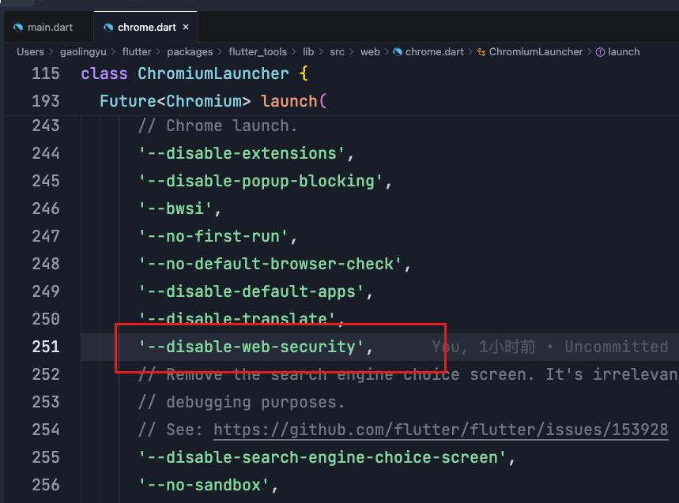

Web 跨域问题实际上需要后端解决，下面属于临时策略
1 在 flutter/packages/flutter_tools/lib/src/web/chrome.dart，如下图位置添加 '--disable-web-security'，禁止浏览器安全策略

2 删除 flutter/bin/cache/下 flutter_tools.snaphot 和 flutter_tools.stamp
3 执行 flutter doctor -v 然后重新运行项目
